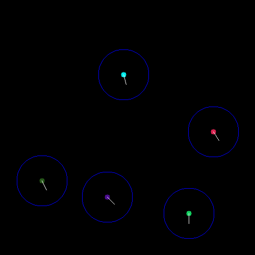

# First collision timestep rarefied gas simulator
This simulator computes all possible intersections, then checks which of those possible intersections is soonest to
occur, and checks if it is a real intersection that will happen, if it will, the simulator runs for Δt time, which
is enough for that collision to occur. Once the intersection occurs, the whole process runs again.
The idea is that CUDA allows this to occur very fast, by computing a lot of data in parallel (all segments and
intersections), and is very precise, not losing precision to particles teleporting.

## Architecture

The general arch is in [architecture.md](https://github.com/EmmanuelMess/FirstCollisionTimestepRarefiedGasSimulator/blob/master/architecture.md).

# Image

# Some refrences and thanks

* [Colliding balls](https://garethrees.org/2009/02/17/physics/): An explanation for the basic idea, but without much implementation info.
* [EasyBMP](https://github.com/izanbf1803/EasyBMP): EasyBMP is an easy to use library to generate BMP images with a simple structure to prototype any project with image generation requirement.
* [cuda-api-wrappers](https://github.com/eyalroz/cuda-api-wrappers): Thin, unified, C++-flavored wrappers for the CUDA APIs 

----

